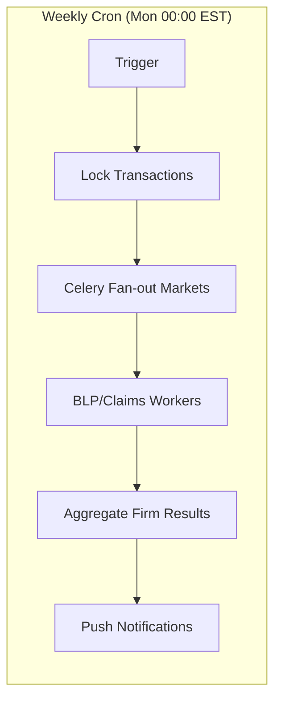

# Insurance Manager – Comprehensive Project Blueprint

*Version 0.2 – June 27 2025 – Added comprehensive Product Design & Diversity System*

---

## Vision & Objectives

- **Purpose** – Provide an academically‑rigorous, turn‑based insurance market simulation that lets students (and researchers) experiment with firm strategy, market structure and regulation.
- **Inspiration** – Marrying the open‑ended business depth of *Capitalism Lab* with the multi‑season management granularity of *Football Manager*.
- **Key Success Metrics** – Player engagement (weekly log‑ins), accuracy of model outputs vs. historical data, instructor satisfaction, research citations.

---

## Core Gameplay Loop

| Phase                    | Player Activities                                                                                                                                                     | Engine Activities                                                                                                                         |
| ------------------------ | --------------------------------------------------------------------------------------------------------------------------------------------------------------------- | ----------------------------------------------------------------------------------------------------------------------------------------- |
| **Monday** *(00:00 EST)* | Receive weekly report, financials, market news, expansion application results.                                                                                        | Rolls previous turn, publishes results, processes expansion approvals.                                                                   |
| **Tue → Sun**            | Enter decisions: premium changes, product design modifications, marketing spend, reinsurance treaties, investment mix, staffing, lobbying, state/line expansion applications. | Validate inputs, check authorization status, pre‑calculate feasibility, model selection effects.                                                                   |
| **Next Mon**             | Observe outcomes including new market authorizations.                                                                                                                 | Run BLP demand model ⇒ simulate policies sold; simulate claims, reserves, solvency checks; update macro environment; store turn snapshot. |

**Time bank**: Players can queue orders early; deadline enforced via cron/Celery beat job.

---

## Market & Geography

- **Starting Position** – Players begin in their home state (determined by alma mater) with one line of business, then expand strategically.
- **Total Market** – 51 jurisdictions × major personal & commercial lines (auto, homeowners, health, life, and liability).
- **Regulatory heterogeneity** – Each state's actual insurance regulatory framework implemented based on real-world laws:
  - Prior approval vs. file-and-use vs. use-and-file rating systems
  - State-specific capital and surplus requirements
  - Unique market conduct regulations and consumer protections
  - Guaranty fund assessment methodologies
  - Residual market mechanisms (JUAs, FAIR plans, assigned risk)
  - Premium tax rates and retaliatory tax provisions
  - Full documentation maintained in `docs/state_ins_regulatory_env/`
- **Economic drivers** – GDP, unemployment, catastrophe exposure (FEMA zones), demographic profiles.
- **Expansion Path** – Adjacent states cost less to enter; national presence unlocks endgame content.

---

## Data & Economic Modeling

**Market Simulation**: The game uses simplified supply and demand mechanics calibrated to real insurance market data:

1. **Price Competition** – Lower prices attract more customers, but price wars hurt everyone's profitability
2. **Product Selection** – Basic products attract worse risks, Premium products attract better risks
3. **Claims Modeling** – Random events based on historical frequencies, with catastrophes creating spikes
4. **Capital Requirements** – Simple RBC formula: must maintain capital equal to 20% of annual premiums

---

## Simulation Engine & Extensibility Architecture

### Core Design Principles

The system is built with a plugin-based architecture that allows features to be added without breaking existing gameplay:

**Modular Game Systems**
- Each major system (expansion, products, employees, etc.) implements a common `GameSystem` interface
- Systems communicate through events, not direct dependencies
- New features can be added as plugins without modifying core engine

**Feature Flags & Progressive Rollout**
```python
class FeatureConfig:
    # Start simple, enable complexity later
    COMPLEX_PRODUCTS = False  # Enable custom product design
    SKILL_TREES = False      # Enable CEO skill trees
    MIDDLE_MANAGEMENT = False # Enable full org charts
    ADVANCED_INVESTMENTS = False # Enable portfolio optimization
    
    # Version-based feature enabling
    def get_enabled_features(game_version):
        if game_version >= "1.1":
            return {"basic_expansion", "simple_products"}
        elif game_version >= "2.0":
            return {"all_v1_features", "complex_products", "skill_trees"}
```

### Extensible Database Schema

Design tables to handle future complexity without migration pain:

```sql
-- Products table can start simple but extend later
CREATE TABLE products (
    id UUID PRIMARY KEY,
    line_id UUID REFERENCES lines(id),
    tier VARCHAR(20), -- 'basic', 'standard', 'premium'
    
    -- Start NULL, populate when features enabled
    custom_features JSONB DEFAULT NULL,
    deductible_options JSONB DEFAULT NULL,
    coverage_matrix JSONB DEFAULT NULL,
    
    -- Versioning for backward compatibility
    schema_version INTEGER DEFAULT 1
);

-- Employees table ready for complexity
CREATE TABLE employees (
    id UUID PRIMARY KEY,
    company_id UUID REFERENCES companies(id),
    role VARCHAR(50), -- Just C-suite initially
    skill_level INTEGER,
    
    -- Future expansion fields
    department_id UUID DEFAULT NULL,
    reports_to_id UUID DEFAULT NULL,
    specializations JSONB DEFAULT NULL,
    personality_traits JSONB DEFAULT NULL
);
```

### API Design for Non-Breaking Changes

Structure APIs to add features without breaking existing clients:

```python
# Expansion API - simple now, extensible later
@router.post("/expand")
async def expand_to_state(request: ExpansionRequest):
    # V1: Simple cost calculation
    cost = calculate_simple_cost(request.state_id, request.company_id)
    
    # V2: Can add complex requirements without breaking V1 clients
    if feature_enabled("COMPLEX_EXPANSION"):
        requirements = check_expansion_requirements(request)
        if not requirements.met:
            return ExpansionResponse(
                allowed=False,
                simple_cost=cost,  # V1 clients still work
                requirements=requirements  # V2 clients get extra data
            )
    
    return ExpansionResponse(allowed=True, cost=cost)
```

### Plugin System for Game Mechanics

```python
class GameSystemPlugin(ABC):
    @abstractmethod
    def on_turn_start(self, game_state): pass
    
    @abstractmethod
    def on_decision_submitted(self, company_id, decisions): pass
    
    @abstractmethod
    def calculate_results(self, game_state): pass

# Start with simple implementations
class SimpleExpansionPlugin(GameSystemPlugin):
    def calculate_results(self, game_state):
        # Fixed costs based on distance/size
        return simple_expansion_logic()

# Later: swap in complex version without changing core
class ComplexExpansionPlugin(GameSystemPlugin):
    def calculate_results(self, game_state):
        # Add regulatory complexity, market studies, etc.
        return complex_expansion_logic()
```

### Configuration-Driven Complexity

```yaml
# game_config_v1.yaml - MVP
game_rules:
  products:
    type: "simple_tiers"
    options: ["basic", "standard", "premium"]
  
  expansion:
    type: "formula_based"
    base_cost: 5000000
    
  employees:
    type: "c_suite_only"
    positions: 5

# game_config_v2.yaml - Future version
game_rules:
  products:
    type: "custom_design"
    components: ["deductibles", "coverage", "riders"]
    
  expansion:
    type: "requirement_based"
    needs_profitability: true
    needs_market_study: true
```

### Migration Path Examples

**Adding Custom Products (V2.0)**
```python
# New product design system as a plugin
class CustomProductPlugin(GameSystemPlugin):
    def upgrade_existing_products(self):
        # Convert simple tiers to custom designs
        for product in Product.objects.filter(schema_version=1):
            product.custom_features = {
                "deductible": TIER_DEFAULTS[product.tier]["deductible"],
                "coverage": TIER_DEFAULTS[product.tier]["coverage"]
            }
            product.schema_version = 2
            product.save()
```

**Adding Middle Management (V2.5)**
```python
# Extends employee system without breaking C-suite-only games
class MiddleManagementPlugin(GameSystemPlugin):
    def on_company_growth(self, company):
        if company.states.count() >= 5 and feature_enabled("MIDDLE_MANAGEMENT"):
            # Auto-create middle management positions
            create_regional_managers(company)
```

### Performance Considerations

- **Language** – Python 3.12 with type hints for better tooling
- **Architecture** – Microservices-ready but deployable as monolith initially
- **Caching** – Redis layer can cache complex calculations when features are added
- **Background Jobs** – Celery workers can handle complex features asynchronously
- **Database** – PostgreSQL with JSONB for flexible schema evolution

### Development Workflow

1. **Feature Branches** – Each new system developed in isolation
2. **Feature Flags** – Test complex features with select users
3. **A/B Testing** – Compare simple vs. complex versions
4. **Gradual Rollout** – Enable features by user segment
5. **Backward Compatibility** – Old save games must always work

This architecture ensures the MVP can ship quickly while providing clear paths to add the complex features from the original vision without requiring major rewrites.

### Code Organization for Extensibility

```
insurance-manager/
├── core/                      # Stable core engine
│   ├── models/               # Base data models
│   ├── engine/               # Turn processing engine
│   ├── interfaces/           # Plugin interfaces
│   └── events/               # Event bus system
├── features/                  # Pluggable feature modules
│   ├── expansion/
│   │   ├── simple.py        # MVP: Formula-based
│   │   └── complex.py       # Future: Requirements-based
│   ├── products/
│   │   ├── tiers.py         # MVP: 3 tiers
│   │   └── custom.py        # Future: Full customization
│   ├── employees/
│   │   ├── csuite.py        # MVP: 5 executives
│   │   └── full_org.py      # Future: Departments
│   └── investments/
│       ├── basic.py         # MVP: Skill multiplier
│       └── portfolio.py     # Future: BLP optimization
├── api/                       # REST/GraphQL endpoints
│   ├── v1/                   # Stable v1 API
│   └── v2/                   # Extended v2 API
├── config/                    # Feature flags & settings
│   ├── features.yaml         # Feature configuration
│   └── game_rules/           # Version-specific rules
└── migrations/                # Database migrations
    ├── core/                 # Core schema
    └── features/             # Feature-specific migrations
```

**Key Principles**:
- Core engine never imports from features
- Features implement standard interfaces
- All feature interactions go through events
- Database schema supports NULL fields for future features
- API versions maintained in parallel
- Configuration drives behavior, not code changes

---

## AI Opponents

| Level       | Algorithm                                             | Behaviour                               |
| ----------- | ----------------------------------------------------- | --------------------------------------- |
| Casual      | Rule‑based heuristics mirroring top‑10 NAIC carriers. | Stable, predictable, teaches basics.    |
| Competitive | Model‑free RL (PPO) trained on historical rolls.      | Seeks profit & share, adapts to humans. |
| Research    | Evolutive multi‑agent RL (MARL) sandbox.              | Toggle‑able for advanced courses.       |

---

## Character & Company Creation

### CEO Creation Flow

Players begin their journey by creating their CEO through a multi-step character creation process that establishes their background, expertise, and starting advantages.

**Step 1: Academic Background**

*First Major* – Risk Management & Insurance (RMI) [Required - Dropdown displays only this option]
This requirement ensures all players have foundational insurance knowledge.

*Second Major* – Players select from a dropdown menu that provides starting stat bonuses:
- Finance (+10 Financial Expertise, +5 Deal Making)
- Actuarial Science (+10 Risk Intelligence, +5 Market Acumen)
- Accounting (+10 Financial Expertise, +5 Regulatory Mastery)
- Marketing (+10 Market Acumen, +5 Innovation Capacity)
- Computer Science (+10 Innovation Capacity, +5 Risk Intelligence)
- Economics (+8 Market Acumen, +7 Financial Expertise)
- Management (+10 Leadership, +5 Crisis Command)
- Law (+10 Regulatory Mastery, +5 Deal Making)

*Graduate Degree* – Advanced education provides specialized benefits:
- None (+$50M starting capital) – Jump straight into business with more resources
- MBA (+15 Leadership, +10 Deal Making, +5 to all other stats)
- MS Finance (+20 Financial Expertise, +10 Market Acumen)
- MS Actuarial Science (+20 Risk Intelligence, +10 Innovation Capacity)
- PhD Economics (+15 Market Acumen, +15 Financial Expertise, unlock advanced analytics from turn 1)
- JD (+20 Regulatory Mastery, +10 Deal Making, reduced rate filing times)
- Executive Education Certificate (+5 to all stats, +$20M starting capital)

**Step 2: Alma Mater Selection**

*School Selection* determines both networking bonuses and starting state:
- University of Iowa → Iowa 
- Florida State University → Florida 
- University of Georgia → Georgia 
- New York University → New York 
- University of Wisconsin → Wisconsin 

**Step 3: Company Foundation**

*Company Name* – Free text entry with profanity filter and uniqueness check within each game instance.

*Starting Line of Business* – Players select their initial specialization:
- Personal Auto (High volume, moderate margins, heavy regulation)
- Homeowners (Weather exposure, bundling opportunities)
- Commercial General Liability (Complex underwriting, higher margins)
- Workers Compensation (Mandatory coverage, state funds competition)
- Professional Liability (High severity, specialized expertise needed)
- Health Insurance (Regulatory complexity, high frequency claims)

Each line provides different starting conditions and strategic paths. Players begin with a "Standard" product configuration featuring medium cost-sharing appropriate to their chosen line.


### Employee System

Companies hire key executives whose skills directly impact operational performance. CEO attributes serve as multipliers for their effectiveness.

**Required C-Suite Positions**

Each position has a skill level (1-100) and salary requirement:

- **Chief Underwriting Officer** – Base salary: $200K-$500K. Affects loss ratios and risk selection quality. Enhanced by CEO Risk Intelligence.
- **Chief Financial Officer** – Base salary: $250K-$600K. Determines investment returns and capital efficiency. Enhanced by CEO Financial Expertise.
- **Chief Marketing Officer** – Base salary: $150K-$400K. Drives premium growth and customer acquisition. Enhanced by CEO Market Acumen.
- **Chief Compliance Officer** – Base salary: $150K-$350K. Reduces regulatory penalties and filing times. Enhanced by CEO Regulatory Mastery.
- **Chief Technology Officer** – Base salary: $200K-$500K. Enables digital features and reduces operating costs. Enhanced by CEO Innovation Capacity.

**Hiring Pool**

Each week, 20 candidates are available for hire across all positions. Each candidate has:
- Skill Level (1-100)
- Salary Requirement (higher skill = higher cost)
- One special bonus (e.g., "+10% investment returns" or "-2 weeks on rate filings")

**Performance Formula**
```
Department Performance = Executive Skill × (1 + CEO Modifier/100)
```

**Simplified Staffing**
- No middle management or operational staff to manage
- Executive effectiveness automatically scales with company size
- Turnover only occurs if you fail to pay salaries
- No complex personality or chemistry systems

---

## Geographic & Product Line Expansion System

### Home State Advantage

All insurance companies begin operations in their founder's home state (determined by alma mater selection), providing significant early-game advantages that encourage mastery before expansion.

**Home State Benefits**:
- **Regulatory Fast Track** – Rate filings approved in 2 weeks instead of standard 6-8 weeks
- **Local Knowledge** – Loss ratios 15% better than out-of-state competitors due to risk familiarity
- **Distribution Network** – Pre-existing agent relationships provide 25% lower acquisition costs
- **Political Capital** – Start with 50 influence points with home state insurance commissioner
- **Claims Efficiency** – Local adjuster network settles claims 30% faster
- **Brand Recognition** – Customer retention rates +20% in home state

### Expansion Prerequisites

Geographic and product expansion uses a straightforward cost formula based on proximity and market size.

**State Expansion Cost Formula**:
```
Base Cost = $5M × Market Size Multiplier × Distance Multiplier

Market Size Multiplier:
- Large markets (CA, TX, NY, FL): 3.0x
- Medium markets (PA, IL, OH, etc.): 2.0x  
- Small markets (VT, WY, AK, etc.): 1.0x

Distance Multiplier:
- Adjacent states: 1.0x
- 1-2 states away: 1.5x
- 3+ states away: 2.0x
```

**Approval Time**: All states require 4-week regulatory approval after payment.

**Product Line Expansion Cost**:
- Auto: $2M
- Homeowners: $3M
- Commercial: $5M
- Health: $10M
- Life: $8M

No additional requirements beyond payment and waiting period.

### Expansion Strategies

Players choose between three distinct approaches to multi-state operations, each with tradeoffs.

**Centralized Model**:
- All operations run from home state headquarters
- Lower fixed costs (-30% administrative expenses)
- Slower claim response times (+2 days average)
- Regulatory scrutiny in non-home states (+10% examination frequency)
- Best for: Financially constrained startups

**Hub & Spoke Model**:
- Regional offices in major markets, satellites elsewhere
- Moderate costs (+15% administrative expenses)
- Balanced local presence and efficiency
- Unlock regional bundling opportunities
- Best for: Measured growth with regional focus

**Fully Distributed Model**:
- Complete local presence in every state
- Highest costs (+40% administrative expenses)
- Fastest claims handling and regulatory responsiveness
- Maximum political influence accumulation
- Best for: Aggressive national expansion

### State Entry Barriers & Opportunities

States are grouped into three regulatory categories that affect gameplay:

**Strict Regulation States** (CA, NY, FL, NC, MA)
- Prior approval required for all rate changes (8-week process)
- Higher capital requirements (+50%)
- Rate increase caps (max 10% per year)
- Benefit: More stable market, less price competition

**Moderate Regulation States** (TX, PA, IL, OH, GA)
- File-and-use rating (rates effective immediately)
- Standard capital requirements
- Market-based pricing allowed
- Benefit: Faster market entry and pricing flexibility

**Light Regulation States** (WY, VT, SD, ID, MT)
- Minimal filing requirements
- Lower capital requirements (-25%)
- Full pricing freedom
- Benefit: Easy entry but intense competition

**Catastrophe Exposure**
- High (FL, CA, TX coastal): +100% reinsurance costs
- Medium (Midwest tornado alley): +50% reinsurance costs
- Low (Northeast, Mountain states): Standard reinsurance costs

### Multi-State Operations

Operating in multiple states adds simple scaling costs:

**Per-State Operating Costs**:
- Fixed cost: $100K per state per quarter
- Variable cost: 2% of premiums written in that state
- Premium tax: 2% of premiums (paid to state)

**Multi-State Benefits**:
- 5+ states: Unlock regional advertising (-10% acquisition costs)
- 10+ states: Economies of scale (-20% fixed costs)
- 25+ states: National presence (+15% brand recognition)
- 50 states: Access Fortune 500 commercial accounts

### Product Line Synergies & Conflicts

Expanding into multiple lines creates opportunities for cross-selling but also operational complexity.

**Natural Bundles**:
- Auto + Homeowners → 15% retention boost, 10% acquisition cost reduction
- Commercial Property + General Liability → Standard BOP offering expected by agents
- Professional Liability + Cyber → Emerging tech E&O market access

**Operational Conflicts**:
- Personal vs Commercial lines require different underwriting expertise
- Health insurance regulations completely separate from P&C
- Life insurance requires distinct reserves and capital treatment

**Cross-Selling Mechanics**:
- Customers with 2+ policies show 40% higher retention
- Bundle discounts reduce per-line profitability by 5-10%
- Agent commission structures must align with multi-line strategy
- Claims coordination across lines affects customer satisfaction

### Expansion Interface

The expansion screen shows a simple US map with color coding:

**State Colors**:
- Green: States where you operate
- Yellow: Adjacent states (cheaper to enter)
- Red: Distant states (more expensive)
- Gray: Not yet available (need more capital)

**Information Display**:
Click any state to see:
- Expansion cost (based on formula)
- Market size (Small/Medium/Large)
- Regulatory type (Strict/Moderate/Light)
- Current competitors and their market share

**Simple Actions**:
- Click "Expand Here" and pay the cost
- Wait 4 weeks for approval
- Start selling immediately upon approval

### Late-Game National Presence

Achieving true national scale unlocks powerful endgame capabilities.

**50-State Achievements**:
- **National Accounts** – Compete for Fortune 500 commercial programs
- **Federal Charter Option** – Bypass state regulation (proposed gameplay feature)
- **Catastrophe Diversification** – Natural hedge reduces reinsurance costs 30%
- **Scale Economics** – Fixed costs spread thin, 5% expense ratio advantage

**Market Power Dynamics**:
- Influence competitor behavior through pricing leadership
- Shape state regulations via model law advocacy
- Access to exclusive reinsurance facilities
- Ability to acquire struggling regional carriers

The expansion system creates a natural progression from regional specialist to national powerhouse, with each decision point offering strategic depth. Players must balance aggressive growth ambitions against operational complexity and capital constraints, mirroring real insurance industry dynamics.


---

## Product Design & Diversity System

### Core Product Architecture

Within each line of business, insurers compete not just on price but on product design. Players can differentiate through cost-sharing structures, coverage breadth, and specialized features. This system models how product design choices affect both demand (through consumer preferences) and profitability (through adverse selection and moral hazard dynamics).

### Product Tiers

Each line of business offers three standardized product tiers with clear tradeoffs:

**Basic Tier** – High deductibles, limited coverage. 20% cheaper premiums but attracts 30% worse risks due to adverse selection.

**Standard Tier** – Balanced cost-sharing and coverage. Starting product for all players. Baseline risk pool.

**Premium Tier** – Low deductibles, comprehensive coverage. 30% higher premiums, attracts 10% better risks but lower volume.

**Product Design Mechanics**:
```
Loss Ratio Impact = Base Loss Ratio × (1 + Selection Effect)
Volume Impact = Base Volume × Price Elasticity Factor

Basic: Selection Effect = +0.3, Price Elasticity = 1.5
Standard: Selection Effect = 0, Price Elasticity = 1.0  
Premium: Selection Effect = -0.1, Price Elasticity = 0.6
```

Players can only offer one tier per line in each state to reduce complexity. Switching tiers requires 4-week notice to existing policyholders.

### Product Design Interface

Within the Chief Underwriting Officer's suite, a sophisticated Product Design Workshop allows granular customization:

**Cost Sharing Sliders** (Each affects demand elasticity and risk selection):
- Deductible Level: Minimum ← → Maximum (Product-specific ranges)
- Coinsurance Split: 100/0 ← → 50/50 (Insurer/Insured share)
- Out-of-Pocket Maximum: Low ← → High (Catastrophic protection)
- Copayment Structure: Flat ← → Percentage (Simplicity vs. risk sharing)

**Coverage Features Toggle Grid**:
Players enable/disable specific coverages, each with cost and selection implications:
- Replacement Cost vs. Actual Cash Value (-/+ 20% premium, -/+ 15% adverse selection)
- Agreed Value vs. Market Value (Low frequency lines only)
- Worldwide Coverage vs. Territorial Limits (-/+ 10% premium)
- Sublimit Structure (Per occurrence vs. aggregate)

**Special Features Marketplace**:
Unlock innovative features through R&D investment or partnerships:
- Telematics Integration ($2M investment, -30% moral hazard)
- Parametric Triggers ($5M development, -50% adjustment expense)
- Embedded Insurance APIs ($3M platform, +40% distribution reach)
- Behavioral Incentives ($1M program, -20% frequency)

### Economic Modeling of Selection Effects

The game's BLP demand system incorporates product characteristics beyond price:

```
Utility[ijt] = α[i] × Price[jt] + β[i] × Deductible[jt] + γ[i] × Coverage_Score[jt] 
               + δ[i] × Brand[j] + ε[ijt]

Where:
- α[i] varies by income (wealthier less price sensitive)
- β[i] varies by risk type (high-risk hate deductibles)
- γ[i] varies by sophistication (educated value coverage)
```

**Adverse Selection Dynamics**:

The system models how product design attracts different risk types:

```python
def calculate_selection_effect(product_config, market_products):
    # More generous coverage attracts worse risks
    coverage_generosity = (1 - product_config.deductible_percentile) 
                         * product_config.coinsurance_rate
                         * product_config.sublimit_score
    
    # Compare to market average
    market_avg_generosity = average([p.generosity for p in market_products])
    selection_multiplier = 1 + 0.3 * (coverage_generosity - market_avg_generosity)
    
    # Worse selection → higher frequency and severity
    base_loss_cost = base_loss_cost * selection_multiplier
    
    # But also affects demand
    demand_boost = 1 + 0.2 * coverage_generosity
    
    return base_loss_cost, demand_boost
```

**Moral Hazard Mechanics**:

Lower cost sharing increases claim frequency through reduced "skin in the game":

```python
def moral_hazard_adjustment(deductible, coinsurance_rate):
    # Normalized deductible impact (0-1 scale)
    deductible_effect = 1 - exp(-deductible / avg_claim_size)
    
    # Coinsurance impact
    coinsurance_effect = coinsurance_rate / 100
    
    # Combined moral hazard multiplier
    frequency_multiplier = 1 + 0.4 * (1 - deductible_effect) * (1 - coinsurance_effect)
    severity_multiplier = 1 + 0.2 * (1 - coinsurance_effect)
    
    return frequency_multiplier, severity_multiplier
```

### Product Performance Analytics

The Chief Actuary's office provides detailed product-level diagnostics:

**Selection Monitoring Dashboard**:
- Loss ratio by deductible band
- Customer risk score distribution by product
- Competitor product positioning map
- Migration analysis between products

**Profitability Attribution**:
- Premium volume by product variant
- Loss costs adjusted for selection/moral hazard
- Expense allocation by product complexity
- Return on allocated capital by product

**Market Intelligence** (Via CMO's office):
Players can purchase detailed reports showing:
- Customer preference curves for different cost-sharing levels
- Price elasticity by product configuration
- Competitor product launches and modifications
- Regulatory warnings about discriminatory designs

### Strategic Considerations

**Product Portfolio Strategy**:
- Offering multiple variants can segment the market but increases adverse selection
- "Bronze/Silver/Gold" tiers common but must price for selection spiral risk
- Single product strategies avoid selection but miss market segments

**Death Spiral Prevention**:
If generous products attract only bad risks, premiums spike, good risks leave, and the cycle accelerates. Players must monitor:
- Enrollment mix changes
- Competitor product changes that might trigger selection
- Early warning indicators in claims emergence

**Regulatory Constraints**:
- Some states mandate minimum coverage levels
- Rate bands limit price discrimination between products
- Anti-selection rules may require offering all products to all customers
- Essential health benefits requirements for health insurance

**Innovation Rewards**:
First-mover advantages for novel products:
- 6-month exclusivity period before competitors can copy
- Patent-like protection for parametric triggers
- Brand recognition bonus for category creation
- Lower acquisition costs from publicity

### Product Development

Switching between product tiers is simple:

**Tier Change Requirements**:
- Cost: $100K per state where product is offered
- Time: 4 weeks for regulatory approval
- Customer notice: Existing customers can keep old tier for 1 year

**No Complex Development**:
- All tiers are pre-defined (Basic/Standard/Premium)
- No custom product creation
- No R&D or innovation systems

### Late-Game Product Mastery

**National Product Platforms**:
After achieving 25+ state presence, unlock:
- Multi-state product filings (reduce costs 50%)
- National advertising campaigns for innovative products
- Federal product exemptions for novel designs
- Cross-subsidy strategies using state variations

**Behavioral Economics Lab**:
$10M investment unlocks academic partnership:
- A/B testing infrastructure for product features
- Choice architecture optimization
- Nudge design for healthy behaviors
- Predictive models of customer switching

**Product-as-a-Service Evolution**:
Transform from insurance products to risk platforms:
- Real-time pricing APIs
- Embedded coverage in other services
- Parametric everything (flight delays, weather, crypto)
- Risk pools for sharing economy

The product diversity system adds a crucial strategic layer – success requires not just competitive pricing but thoughtful product design that balances market appeal against selection risks. Players learn fundamental insurance economics through experimentation with cost sharing, discovering how generous benefits can become a poisoned chalice without proper pricing for induced demand and worsened risk pools.

---

## CEO Development & Progression System

### Core CEO Attributes

Players develop their CEO character whose attributes serve as multipliers for employee performance across the organization:

**Leadership** (1-100) – The foundational stat that affects all employees regardless of department. Provides a universal productivity boost at 50% strength to every employee in the company. Also influences employee retention rates and morale recovery speed after negative events.

**Risk Intelligence** (1-100) – Multiplies the effectiveness of underwriting staff, actuaries, and risk officers. A CEO with high Risk Intelligence empowers their Chief Underwriter to select better risks, their actuaries to price more accurately, and their risk team to identify emerging threats earlier.

**Market Acumen** (1-100) – Enhances performance of marketing, sales, and competitive intelligence teams. Marketing managers under a market-savvy CEO generate more leads per dollar spent, while business development staff identify expansion opportunities others miss.

**Regulatory Mastery** (1-100) – Boosts the capabilities of compliance officers, legal teams, and government relations staff. A CEO well-versed in regulation helps their compliance team navigate complex filings faster and their legal department negotiate more favorable settlements.

**Innovation Capacity** (1-100) – Amplifies the output of technology teams, R&D departments, and process improvement specialists. IT staff under an innovative CEO implement systems faster and more efficiently, while innovation teams develop breakthrough products.

**Deal Making** (1-100) – Multiplies effectiveness of M&A teams, reinsurance negotiators, and partnership managers. A CEO skilled in deals helps their CFO secure better reinsurance terms and their corporate development team identify undervalued acquisition targets.

**Financial Expertise** (1-100) – Enhances performance of investment managers, treasury staff, and financial analysts. A financially sophisticated CEO enables their investment team to generate superior returns and their analysts to identify cost savings others overlook.

**Crisis Command** (1-100) – Activates during catastrophe events and major market disruptions, providing temporary boosts to all claims staff, emergency response teams, and public relations personnel. Unlike other stats, this provides its full bonus only during crisis turns.

### Random Events

Each quarter has a 20% chance of a random event:

**Positive Events**:
- Industry Award: +5 to chosen CEO stat
- Favorable Regulation: -2 weeks on rate filings for 1 year
- Talent Windfall: Star executive available for hire
- Market Opportunity: Competitor exits a state, reducing competition

**Negative Events**:
- Regulatory Scrutiny: +4 weeks on rate filings for 6 months
- Catastrophe: 2x normal claims in affected states
- Talent Poaching: One executive leaves (must rehire)
- Market Disruption: New competitor enters with 20% lower rates

Events are simple binary choices or automatic effects, no complex decision trees.

### CEO Development

CEOs gain experience and improve their stats through simple progression:

**Stat Improvement**:
- Each profitable quarter: +1 to a chosen stat
- Major milestone ($100M profit): +5 to a chosen stat
- Random events: +2 to +5 based on choices

**Experience Unlocks** (Cumulative company lifetime profit):
- $50M: Advanced analytics (-10% loss ratios)
- $100M: Fast-track rate approvals (2 weeks instead of 4)
- $250M: Premium investment access (+5% returns)
- $500M: National advertising (-20% acquisition costs)
- $1B: Industry influence (see competitor moves 1 week early)

**No Complex Systems**:
- No skill trees or branches to manage
- No stat decay or maintenance
- Simple, clear progression tied to profitability

### Integration with Core Gameplay

CEO stats serve as performance multipliers for employees rather than directly modifying game mechanics:

**Primary Effect**: Each CEO stat provides a percentage boost to relevant employee effectiveness using the formula: `Effective Performance = Base Skill × (1 + CEO Stat/100)`

**Secondary Effects**:
- Leadership universally affects all employees at 50% strength (e.g., 100 Leadership gives +50% to all)
- Higher stats attract better employees to the available pool
- Stat thresholds unlock special employee recruitment events
- Crisis Command activates special bonuses during catastrophe turns only

**Employee Performance Examples**:
- CEO with 80 Risk Intelligence → Chief Underwriter performs at 180% effectiveness
- CEO with 60 Market Acumen → Marketing team achieves 160% of base premium targets
- CEO with 100 Financial Expertise → CFO's investment decisions yield 200% of base returns

The system creates meaningful long-term progression through the interplay of CEO development and employee management. Players must balance investing in their own skills versus paying for high-quality employees, as both paths can achieve success but require different resource allocation strategies.

---

## Endgame & Legacy System

### Bankruptcy

When a firm's Risk-Based Capital falls below regulatory requirements or the company becomes insolvent, the state insurance regulator takes control. The player can then either continue with their existing CEO (keeping 85% of their developed stats) to start a new firm, or create an entirely new CEO from scratch.

### CEO Retirement

All CEOs retire at age 65. Since CEOs start between ages 35-40, this provides 25-30 years of gameplay. When retirement occurs, the firm transitions to AI control and the player must create a new CEO to continue.

### Voluntary Departure

Players can choose to leave their firm before retirement. The firm continues under AI control. If players leave voluntarily, they keep all their CEO stats for their next venture. If they wait until forced retirement, they start fresh.

### AI Market Entry

When industry average ROE exceeds 15%, the system spawns new AI competitors to maintain market competition. These AI firms follow basic strategies based on market conditions - aggressive pricing in profitable markets, conservative approaches in difficult markets. This prevents any player or group of players from maintaining excessive profitability indefinitely.

---

## Investment Management System

### Characteristic-Based Portfolio Construction

Rather than directly allocating to asset classes, players set their desired portfolio characteristics through intuitive sliders. This mirrors how institutional investors actually think about portfolios - in terms of risk/return profiles rather than specific securities.

**Portfolio Characteristic Sliders:**

**Risk Tolerance** (Conservative ← → Aggressive)
- Maps to risk aversion parameter γ in utility optimization
- Conservative: γ = 5 (high penalty for volatility)
- Aggressive: γ = 0.5 (willing to accept volatility for returns)

**Return Target** (Preservation ← → Growth)
- Sets minimum acceptable portfolio return constraint
- Preservation: E[r] ≥ Risk-free + 100bp
- Growth: E[r] ≥ Risk-free + 600bp

**Tail Risk Preference** (Avoid Fat Tails ← → Accept Skewness)
- Controls tolerance for negative skewness and kurtosis
- Avoid: Heavy penalty for assets with catastrophe risk
- Accept: Willing to sell volatility for premium

**Liability Matching** (Asset-Only ← → ALM Focus)
- Preference for assets correlated/uncorrelated with claims
- Asset-Only: Ignore insurance liabilities
- ALM Focus: Seek negative correlation with claims patterns

**Liquidity Needs** (High Liquidity ← → Illiquidity Premium)
- Minimum portfolio liquidity score requirement
- High: Maintain 80%+ in liquid assets
- Premium: Accept 20% liquidity for +200bp yield

### CFO Skill Impact on Investment Knowledge

CFO skill determines how accurately they perceive investment characteristics. All investments have true risk/return profiles, but CFOs see them with noise:

**Information Quality by Skill Level**:
```
Perceived Value = True Value + Random Error

CFO Skill < 50: Error Range = ±50% (May think junk bonds are safe)
CFO Skill 50-75: Error Range = ±20% (Generally correct but imprecise)
CFO Skill 75-90: Error Range = ±10% (Good estimates, minor errors)
CFO Skill 90+: Error Range = ±5% (Near-perfect information)
```

**Natural Performance Differences**:
- Low-skill CFOs make poor choices due to bad information (buying overvalued assets, selling undervalued ones)
- High-skill CFOs make better choices due to accurate information
- Returns emerge from portfolio decisions, not skill multipliers

**Crisis Liquidation**:
When forced to sell for claims, information quality determines which assets get sold:
- Low-skill CFOs may panic-sell liquid treasuries while holding illiquid junk
- High-skill CFOs sell optimally based on true liquidity and values

### Portfolio Optimization Engine

The system translates characteristic preferences into actual portfolios through convex optimization:

```python
def optimize_portfolio(preferences, observed_characteristics, skill_level):
    # Build utility function from preferences
    U(w) = expected_return(w, observed_characteristics)
           - (preferences.risk_tolerance/2) × variance(w, observed_characteristics)
           - preferences.tail_penalty × skewness_penalty(w)
           - preferences.alm_weight × liability_mismatch(w)
           - preferences.liquidity_penalty × illiquidity_cost(w)
    
    # Add constraints based on regulations and preferences
    constraints = [
        sum(w) == 1,                              # Fully invested
        w >= 0,                                   # No shorting
        liquidity_score(w) >= preferences.min_liquidity,
        expected_return(w) >= preferences.return_target,
        w[asset] <= regulatory_limits[asset]      # RBC limits
    ]
    
    # Solve with noise based on skill
    if skill_level < 50:
        # Novice: Random perturbations to optimal solution
        w_optimal = solve_convex(U, constraints)
        w_final = w_optimal + uniform_noise(-0.2, 0.2)
    elif skill_level < 75:
        # Professional: Some implementation shortfall
        w_final = 0.8 × solve_convex(U, constraints) + 0.2 × equal_weight
    else:
        # Expert+: Can achieve theoretical optimum
        w_final = solve_convex(U, constraints)
    
    return normalize(w_final)
```

### Market Dynamics & Price Discovery

Asset returns emerge from the interaction of all players' optimized demands:

**Weekly Market Clearing Process:**

1. **Each firm submits** characteristic preferences via sliders
2. **System computes** optimal portfolio for each firm given their observed (noisy) characteristics
3. **Aggregate demand** creates buy/sell pressure for each asset
4. **Prices adjust** to clear markets:
   ```
   Return_adjustment = -λ × (Net_demand / Market_cap)
   New_return = Base_return + Return_adjustment
   ```
5. **Iteration** continues until convergence or timeout

### Automated Liquidation Mechanics

When insurance companies face liquidity shortfalls from catastrophe claims, regulatory capital calls, or operational needs, the system automatically liquidates portfolio assets based on the CFO's skill level. Players don't directly control these sales - instead, their CFO's effectiveness determines how efficiently assets are sold into the general market. This creates dramatic differences in realized losses between firms with novice versus expert financial leadership.

**Liquidity Need Triggers**

Each Monday morning, the system calculates every firm's immediate cash needs including catastrophe claim payments due within the week, regulatory minimum cash requirements, operational expenses and payroll, and margin calls on investment positions. When available cash falls short, the system initiates automatic liquidation with an urgency factor scaling from 1.0 (comfortable buffer) to 3.0 (severe crisis), determining how aggressively assets must be sold.

**CFO Skill Determines Liquidation Intelligence**

The critical mechanic is that CFO skill determines which assets get sold and at what prices, simulating how financial expertise affects crisis management. The system models each CFO's imperfect information about asset characteristics, creating realistic mistakes and suboptimal decisions that mirror real-world financial crises.

**Novice CFO Liquidation (Skill < 50)**

Novice CFOs make catastrophic errors due to severely distorted perceptions of asset characteristics. The liquidation algorithm for low-skill CFOs follows panic-driven heuristics:

```python
def novice_liquidation(portfolio, liquidity_need, observed_characteristics):
    # Novice CFOs sort by completely wrong criteria
    # May think junk bonds are safe and Treasuries are risky
    sorted_assets = sort_by_perceived_liquidity(portfolio, observed_characteristics)
    
    cumulative_proceeds = 0
    assets_to_sell = []
    
    for asset in sorted_assets:
        # Massive mispricing due to poor information
        perceived_value = observed_characteristics[asset].value  # Contains huge errors
        panic_discount = 0.3 * urgency_factor  # Panic selling
        
        sell_price = perceived_value * (1 - panic_discount)
        true_price = true_market_price(asset) * (0.95 - 0.02 * urgency_factor)
        
        # Often sells at huge discounts unnecessarily
        assets_to_sell.append((asset, min(sell_price, true_price)))
        cumulative_proceeds += sell_price * quantity
        
        if cumulative_proceeds >= liquidity_need:
            break
    
    return assets_to_sell
```

This leads to disasters like selling Treasury bonds at 70 cents on the dollar while desperately holding illiquid real estate they mistakenly believe is liquid, or dumping investment-grade corporates in panic while keeping structured products they can't actually sell.

**Professional CFO Liquidation (Skill 50-75)**

Professional CFOs follow more structured approaches but still make meaningful errors:

```python
def professional_liquidation(portfolio, liquidity_need, skill):
    # Better but still noisy asset evaluation
    error_magnitude = 0.3 * (75 - skill) / 25
    
    # Attempts proper sequencing but with errors
    liquidity_rankings = estimate_liquidity_ladder(portfolio, error_magnitude)
    
    # Knows to start with liquid assets but may misclassify
    # Achieves 70-85% of optimal liquidation value
```

These CFOs generally avoid the worst mistakes, knowing to sell liquid assets first, but might still misclassify assets at the margin, leading to unnecessary losses of 5-15% versus optimal execution.

**Expert CFO Liquidation (Skill 75-90)**

Expert CFOs execute near-optimal liquidation strategies with minimal information errors:

```python
def expert_liquidation(portfolio, liquidity_need, skill):
    # Highly accurate asset assessment
    true_liquidity_ladder = get_true_liquidity_rankings(portfolio)
    execution_noise = 0.1 * (90 - skill) / 15
    
    # Sophisticated multi-period optimization
    if urgency < 2.0:
        # Can be patient, minimize market impact
        return staggered_liquidation_plan(portfolio, liquidity_need)
    else:
        # Even under pressure, maintains discipline
        return optimized_immediate_liquidation(portfolio, liquidity_need)
```

Expert CFOs achieve 90-95% of theoretical best execution, selling truly liquid assets first and understanding market depth to minimize price impact.

**Master CFO Liquidation (Skill 90+)**

Master CFOs possess near-perfect market intelligence and can even turn crises into opportunities:

```python
def master_liquidation(portfolio, liquidity_need, skill):
    # Perfect information about market conditions
    market_depth = get_exact_market_depth_by_asset()
    future_liquidity_needs = predict_next_week_needs()
    
    # May intentionally oversell to build war chest
    if predict_market_stress_continuing():
        target_raise = liquidity_need * 1.5  # Opportunistic
    
    # Achieves 98%+ of optimal value
    # Sometimes profits from volatility via strategic timing
```

Master CFOs might recognize that selling $100M of Treasuries today at 99 cents enables buying $120M of distressed corporate bonds next week at 60 cents from other insurers' forced sales.

**Market Pricing and Depth**

The general market provides liquidity with price elasticity calibrated from academic studies. Market depth varies by asset type and overall stress levels:

```python
def market_price_impact(asset_type, volume, market_conditions):
    base_depth = LIQUIDITY_FACTORS[asset_type]  # Treasury: 10.0, Corp: 2.0, Real Estate: 0.1
    stress_multiplier = 1 / (1 + market_conditions.aggregate_selling_pressure)
    
    # Temporary impact (reverses over time)
    temp_impact = 0.01 * (volume / (base_depth * stress_multiplier)) ** 0.5
    
    # Permanent impact (information content)
    perm_impact = 0.001 * urgency_factor * (volume / daily_volume)
    
    return -(temp_impact + perm_impact)
```

During calm markets, even large Treasury sales barely move prices. During systemic stress when multiple insurers liquidate simultaneously, corporate bond prices can gap down 20-30% while real estate becomes effectively unsaleable.

**Strategic Portfolio Construction Implications**

This automated liquidation system creates profound strategic considerations for portfolio construction. Players must balance yield maximization against liquidity risk, knowing their CFO's skill level determines crisis outcomes. A novice player might rationally choose 80% Treasuries despite low yields, while a player with a Master CFO can safely hold 60% in higher-yielding illiquid assets.

The system rewards players who match portfolio risk to their CFO capabilities. Hiring a better CFO doesn't just improve returns - it provides catastrophe insurance by ensuring intelligent liquidation under stress. This creates natural progression where players start conservative, invest in CFO talent, then gradually take more portfolio risk as their liquidation intelligence improves.

**Observable Outcomes and Learning**

After each liquidation event, players receive detailed reports showing assets sold and prices achieved versus true market values, total liquidation costs as percentage of amount raised, and comparison to what optimal execution would have achieved. This transparency helps players learn the value of CFO investment while creating dramatic moments when novice CFOs destroy millions in value through poor execution.

The mechanic ensures that liquidity management remains a constant strategic consideration. Players see competitors forced into devastating liquidations and must decide whether to maintain expensive cash buffers or invest in better CFO talent as insurance against future crises. The system naturally generates financial crises where cascading liquidations create opportunities for well-prepared firms, matching real insurance industry dynamics during events like the 2008 financial crisis.

---

## Technology Stack

| Layer       | Tech                                                                      | Notes                                  |
| ----------- | ------------------------------------------------------------------------- | -------------------------------------- |
| Frontend    | **Next.js 14 (React 18)**, TypeScript, Tailwind CSS, shadcn/ui components | SSR for SEO, SWR for data fetching.    |
| State Mgmt  | TanStack Query, Zustand                                                   | Offline cache for decision forms.      |
| Backend API | FastAPI, Pydantic V2                                                      | JWT/OAuth2 login via Auth0/Keycloak.   |
| Data        | PostgreSQL (OLTP), DuckDB (OLAP), Redis (cache/locks)                     | TimescaleDB extension for time‑series. |
| ML/Sim      | Python, PyTorch, JAX (optional), CVXPY                                    | Dedicated GPU node optional.           |
| Async Tasks | Celery + Redis broker                                                     | Celery beat schedules Monday run.      |
| Infra       | Docker Compose → Kubernetes (Helm) on AWS EKS                             | Terraform IaC; ArgoCD for GitOps.      |
| CI/CD       | GitHub Actions → Amazon ECR, Snyk scan, pytest, Playwright e2e            | Blue/green deploy.                     |

---

## User Interface Architecture – Executive Office Navigation

Drawing inspiration from Football Manager's intuitive tab-based navigation, the Insurance Manager UI centers around a left-side navigation panel featuring nine executive offices. Each office serves as a thematic hub for related game functions, complete with unique visual identity and specialized workflows.

### Office Structure & Responsibilities

**CEO's Office** – The player's primary inbox and command center. Features include weekly performance summaries, urgent notifications requiring executive decisions, board directives, shareholder communications, and strategic initiatives tracker. The office displays a mahogany-paneled executive suite aesthetic with real-time market tickers and competitor movements.

**Chief Underwriting Officer** – Controls product strategy and risk selection. Players set underwriting guidelines by line of business, adjust pricing tiers and rate factors, evaluate new state entry opportunities (requiring capital and regulatory approval), manage multi-state rate coordination, approve large commercial accounts, and monitor loss ratios by segment. The interface showcases policy flow visualizations, expansion feasibility heat maps, and state-by-state performance metrics. The office includes a sophisticated Product Design Workshop where players customize cost-sharing parameters (deductibles, coinsurance, out-of-pocket maximums) and coverage features for each product variant, with real-time modeling of adverse selection and moral hazard impacts.

**Chief Risk Officer** – Manages enterprise risk and capital allocation. Key functions include setting risk appetite statements, configuring reinsurance programs and treaty structures, monitoring aggregation scenarios and probable maximum loss, stress testing against catastrophe events, and maintaining risk-based capital ratios. Features dynamic risk dashboards with Monte Carlo simulation outputs.

**Chief Accounting Officer** – Oversees financial reporting and reserves. Activities encompass reviewing statutory financial statements, setting loss reserve levels by line, managing expense allocations, monitoring premium deficiency reserves, and tracking investment income recognition. The office displays traditional ledger aesthetics with modern data visualization overlays.

**Chief Technical Officer** – Handles claims operations and systems. Players manage claims handling guidelines, set authority levels and settlement strategies, invest in fraud detection capabilities, upgrade policy administration systems, and optimize straight-through processing rates. The interface emphasizes operational metrics and automation opportunities.

**Chief Compliance Officer** – A dimly lit chamber of moral flexibility adorned in the finest dark academia aesthetic—mahogany bookshelves filled with unread regulatory tomes, flickering brass desk lamps casting shadows over leather-bound volumes of "Creative Accounting Through the Ages," and oil portraits of disgraced financial executives watching over the proceedings. The office contains but a single instrument of power: an ornate brass dial, its face divided between "All of the Crime" (left) and "No Crime" (right), with notches marking the spectrum of corporate malfeasance.

As players adjust this moral compass, compliance costs scale exponentially toward righteousness: `Cost = Base × e^(5×dial_position)` where dial_position ranges from 0 (full crime) to 1 (full compliance). Conversely, the probability of regulatory detection follows a logarithmic decay: `Detection_Risk = -log(1 - 0.99×dial_position)`, ensuring that even maximum crime carries a slim chance of consequences.

Players embracing the darker path receive encrypted emails from legendary institutions of flexible ethics. Credit Suisse's "Special Situations Department" and Deutsche Bank's "Regulatory Innovation Team" regularly propose lucrative schemes—offshore reinsurance shells promising 40% expense reduction, claims adjustment "optimization" programs, or premium skimming operations. Each opportunity presents risk/reward calculations: accept the Swiss proposal for +$50M immediate cash but risk a $200M fine (15% chance), or partner with Deutsche on regulatory arbitrage for sustained +20% ROE with escalating detection probability.

The office ambiance shifts with dial position—at maximum compliance, classical music plays softly while compliance certificates gleam on the walls. As the dial turns toward crime, the lights dim further, the portraits' eyes seem to follow the player, and the faint sound of shredding documents emanates from hidden spaces. A raven occasionally taps at the window, delivering particularly dubious propositions from unnamed Cayman Islands entities.

**Chief Marketing Officer** – Drives distribution and brand strategy. Players allocate marketing budgets across channels, design agent compensation structures, launch advertising campaigns by demographic, manage digital presence and insurtech partnerships, and track customer acquisition costs. The office showcases campaign performance analytics and distribution network maps.

The CMO's office also houses the Competitive Intelligence Division, where players can purchase retrospective market research reports for $100,000 per state-line combination. These reports run counterfactual simulations showing how the firm's sales volume, market share, and premium income would have performed under alternative pricing strategies while holding all competitors' actual prices constant from the previous period. The analysis displays a pricing sensitivity matrix ranging from -20% to +20% of the firm's actual rates, with granular breakdowns of customer switching patterns, price elasticity impacts, and revenue optimization curves.

Each report comes with prominent disclaimers warning that competitors actively monitor market conditions and will adjust their own pricing strategies in response to observed changes, making these historical analyses useful for understanding market dynamics but potentially misleading for future prediction. The interface displays this warning in stark text: "Historical Analysis Only – Competitors Will React to Your Future Moves." The reports become available every Tuesday morning after the Monday market roll, providing a one-week learning window before the next decision deadline.

**Chief Financial Officer** – Manages investments through an elegant characteristic-based interface. Rather than picking individual assets, players adjust five portfolio preference sliders: Risk Tolerance (Conservative ↔ Aggressive), Return Target (Preservation ↔ Growth), Tail Risk (Avoid ↔ Accept), Liability Matching (Ignore ↔ ALM Focus), and Liquidity Needs (High ↔ Low). 

The system's sophistication lies in information asymmetry - all assets have true characteristics (return, volatility, skewness, liquidity, etc.) but CFOs observe them with noise inversely proportional to their skill. A novice CFO might see treasuries as risky and junk bonds as safe, leading to catastrophic portfolio construction. Expert CFOs see through the noise and can pay for research reports, while master CFOs gain predictive insights about characteristic changes.

When liquidity crises hit, this information asymmetry creates dramatic fire sales - novice CFOs might panic-sell liquid treasuries while desperately holding illiquid real estate they mistakenly believe is liquid. The office displays noisy characteristic estimates that become clearer as CFO skill improves, creating a natural progression system that rewards player investment in talent.

**Chief Actuary** – Provides pricing and reserving expertise. Players review experience studies and loss development factors, calibrate pricing models and rate indications, perform reserve adequacy testing, design new product features and coverage options, and analyze competitive intelligence. The office emphasizes statistical visualizations and predictive model outputs.

### Navigation & Visual Design

The left navigation panel maintains persistent visibility across all game screens, with the currently active office highlighted. Each office tab features a distinctive icon and color scheme reflecting its function – CEO's Office in executive gold, Risk in cautionary amber, Compliance in regulatory blue, etc. Office backgrounds include thematically appropriate imagery such as actuarial charts, marketing campaigns, or compliance documents, creating immersive role-playing environments.

Transitioning between offices triggers subtle animations while maintaining game state. Players can pin frequently-used functions from any office to a customizable quick-access toolbar. The design philosophy emphasizes reducing cognitive load by grouping related decisions within their natural organizational context, mirroring how real insurance executives delegate and compartmentalize responsibilities.

---

## Multiplayer & Turn Scheduler



- Hard cutoff enforced by DB trigger; late decisions default to "no change".
- WebSocket channel (`/events`) streams live completion status.

---

## Database Schema (Extensible Design)

```sql
-- Core tables designed for future expansion
CREATE TABLE users (
    id UUID PRIMARY KEY,
    email VARCHAR(255) UNIQUE,
    -- JSONB for future user preferences/settings
    preferences JSONB DEFAULT '{}'
);

CREATE TABLE companies (
    id UUID PRIMARY KEY,
    user_id UUID REFERENCES users(id),
    name VARCHAR(255),
    capital DECIMAL(15,2),
    home_state_id UUID REFERENCES states(id),
    -- JSONB fields for future features without schema changes
    ai_config JSONB DEFAULT NULL,  -- Future: AI personality settings
    culture_traits JSONB DEFAULT NULL,  -- Future: Company culture system
    schema_version INTEGER DEFAULT 1
);

CREATE TABLE states (
    id UUID PRIMARY KEY,
    code CHAR(2) UNIQUE,
    name VARCHAR(100),
    -- Simple enum for MVP, JSONB for future complexity
    regulatory_category VARCHAR(20), -- 'strict', 'moderate', 'light'
    regulatory_details JSONB DEFAULT '{}',  -- Future: Detailed regulations
    market_size VARCHAR(20)  -- 'small', 'medium', 'large'
);

CREATE TABLE products (
    id UUID PRIMARY KEY,
    company_id UUID REFERENCES companies(id),
    line_id UUID REFERENCES lines(id),
    state_id UUID REFERENCES states(id),
    -- Simple tier system for MVP
    tier VARCHAR(20), -- 'basic', 'standard', 'premium'
    -- Extensible fields for future product customization
    custom_config JSONB DEFAULT NULL,
    pricing_model JSONB DEFAULT NULL,
    features_enabled JSONB DEFAULT '[]',
    version INTEGER DEFAULT 1
);

CREATE TABLE employees (
    id UUID PRIMARY KEY,
    company_id UUID REFERENCES companies(id),
    position VARCHAR(50),  -- Just C-suite for MVP
    skill_level INTEGER,
    salary DECIMAL(10,2),
    -- Future expansion fields
    department_tree JSONB DEFAULT NULL,  -- Future: Org hierarchy
    skills_detail JSONB DEFAULT NULL,    -- Future: Skill specializations
    personality JSONB DEFAULT NULL       -- Future: Complex HR system
);

-- Game state tables
CREATE TABLE turns (
    id UUID PRIMARY KEY,
    number INTEGER,
    start_time TIMESTAMP,
    end_time TIMESTAMP,
    -- Store game version to handle rule changes
    game_version VARCHAR(10),
    -- Extensible turn configuration
    special_rules JSONB DEFAULT '{}'
);

CREATE TABLE company_decisions (
    id UUID PRIMARY KEY,
    company_id UUID REFERENCES companies(id),
    turn_id UUID REFERENCES turns(id),
    -- All decisions stored as JSONB for flexibility
    decisions JSONB NOT NULL,
    -- Track which features were active
    features_used TEXT[] DEFAULT '{}'
);

-- Results storage with versioning
CREATE TABLE turn_results (
    id UUID PRIMARY KEY,
    turn_id UUID REFERENCES turns(id),
    company_id UUID REFERENCES companies(id),
    -- Core metrics
    premiums_written DECIMAL(15,2),
    claims_paid DECIMAL(15,2),
    ending_capital DECIMAL(15,2),
    -- Extensible results storage
    detailed_results JSONB,
    -- For backward compatibility
    result_schema_version INTEGER DEFAULT 1
);

-- Feature flags table for progressive rollout
CREATE TABLE feature_flags (
    id UUID PRIMARY KEY,
    feature_name VARCHAR(100) UNIQUE,
    enabled BOOLEAN DEFAULT FALSE,
    -- Control rollout by user segment
    enabled_for_users UUID[] DEFAULT '{}',
    enabled_for_companies UUID[] DEFAULT '{}',
    configuration JSONB DEFAULT '{}'
);

-- Audit log for all changes (useful for debugging/analytics)
CREATE TABLE game_events (
    id UUID PRIMARY KEY,
    timestamp TIMESTAMP DEFAULT NOW(),
    event_type VARCHAR(100),
    entity_type VARCHAR(100),
    entity_id UUID,
    old_value JSONB,
    new_value JSONB,
    metadata JSONB DEFAULT '{}'
);
```

---

## API Surface (REST-ish)

- `GET /v1/turns/current` → summary & deadline.
- `POST /v1/decisions` → upsert player orders.
- `GET /v1/reports/:company_id/:turn_id` → financials.
- `WS /v1/events` → result pushed when roll completes.

GraphQL alternative: single endpoint + subscriptions.

---

## DevOps & Observability

- **Logging** – structlog JSON ⇒ Loki ⇒ Grafana.
- **Metrics** – Prometheus, Grafana dashboards (roll duration, model convergence, player activity).
- **Tracing** – OpenTelemetry (FastAPI, Celery, gRPC).
- **Alerts** – PagerDuty integration (90th‑perc roll > 15 min).

---

## Analytics & Instructor Tools

- Built‑in dashboard (React + Recharts) showing KPIs vs. actual NAIC benchmarks.
- Scenario builder UI: upload CSV overrides (e.g., catastrophe shock, regulatory change) and schedule special turns.
- Export data to CSV/Parquet for research replication.

---

## Security & Compliance

- All endpoints behind TLS 1.3.
- RBAC: student vs. instructor vs. admin.
- Data anonymisation for any real customer‑level records (HIPAA, GLBA).
- Annual penetration test; OWASP ASVS Level 2 baseline.

---

## Accessibility & UX Guidelines

- WCAG 2.1 AA color contrast.
- Keyboard navigation & ARIA labels on interactive tables.
- Live region announcements for turn completion.

---

## Educational Integration

- **LMS plugins** – LTI 1.3 connector for Canvas/Moodle.
- **Assessment hooks** – Auto‑graded quizzes after each turn; instructor rubric on strategic reports.

---

## Feature Evolution Roadmap

### MVP to Full Vision Mapping

| MVP Feature (v1.0) | Future Enhancement (v2.0+) |
|-------------------|---------------------------|
| 3 product tiers (Basic/Standard/Premium) | Full product customization with deductibles, coverage matrices, riders |
| Simple distance/size expansion formula | Complex requirements including profitability gates, market studies, local hiring |
| 5 C-suite positions only | Full organizational charts with middle management, departments, reporting structures |
| 3 state regulation categories | 51 unique state profiles with specific regulations, forms, timelines |
| CFO skill affects info quality | Full BLP demand modeling with portfolio optimization |
| Fixed random events | Narrative event chains with complex decision trees |
| Simple profit unlocks | Branching skill trees with specialization paths |
| Basic price competition | Multi-factor competition including service, brand, distribution |

### Progressive Feature Rollout

**Version 1.0 (Months 1-3)** – MVP with simplified mechanics
- Core gameplay loop functional
- Basic expansion and products
- Simple employee management
- Essential financial mechanics

**Version 1.5 (Months 4-6)** – Quality of Life
- UI/UX improvements based on player feedback  
- Performance optimizations
- Basic analytics and instructor tools
- Mobile-responsive design

**Version 2.0 (Months 7-9)** – Complexity Layer 1
- Custom product design interface
- Expanded employee system with departments
- State-specific regulations (top 10 states)
- Investment portfolio choices

**Version 2.5 (Months 10-12)** – Complexity Layer 2  
- Full 51-state regulatory system
- Middle management and org charts
- Advanced AI opponents
- Catastrophe modeling

**Version 3.0 (Year 2)** – Academic Features
- Full BLP demand modeling
- Research data export
- Scenario builder for instructors
- Published paper replication mode

## Roadmap (12‑Month Indicative)

| Month | Milestone                                                        |
| ----- | ---------------------------------------------------------------- |
| 1–2   | Data ETL, schema, prototype UI wireframes                        |
| 3     | Minimum Viable Turn loop (one state/line, static demand)         |
| 4–5   | Full BLP estimation integration, claims engine                   |
| 6     | State/line expansion system, home state advantages, Alpha test   |
| 7–8   | Multiplayer lobby, AI opponents v1, expansion strategy UI        |
| 9     | Beta (10+ schools), load testing                                 |
| 10    | Regulatory heterogeneity layer, multi-state complexity           |
| 11    | Polishing, documentation, instructor portal                      |
| 12    | v1.0 launch, conference demo, public dataset release             |

---

## Team & Roles

- **Product Owner** – defines educational goals.
- **Tech Lead** – architecture, code reviews.
- **ML Engineer** – BLP, claims, AI opponents.
- **Full‑stack Devs ×2** – UI, API.
- **DevOps** – CI/CD, infra.
- **Domain Expert (Actuary)** – validity checks.
- **UX Designer** – playability & accessibility.

---

## Risks & Mitigation

| Risk                                        | Likelihood | Impact | Mitigation                                                         |
| ------------------------------------------- | ---------- | ------ | ------------------------------------------------------------------ |
| Compute cost of BLP per week spikes         | Medium     | High   | Cache coefficients, cluster‑level parallelism, stratified sampling |
| Regulatory realism overwhelming for players | Medium     | Medium | Difficulty settings, modular unlocks                               |
| Multiplayer desync / roll failures          | Low        | High   | Transactional DB locks, rollback plan, staging tests               |

---

## References & Reading List

1. Berry, Levinsohn & Pakes (1995) – *Automobile Prices in Market Equilibrium*.
2. Schmeiser & Wagner (2012) – *New Risk‑Based Capital Standards in Insurance*.
3. Ohlson & Altman (1999) – *Predicting Financial Distress*.
4. NAIC – *Property/Casualty Insurance Fundamentals*.

---

*End of Blueprint.*

